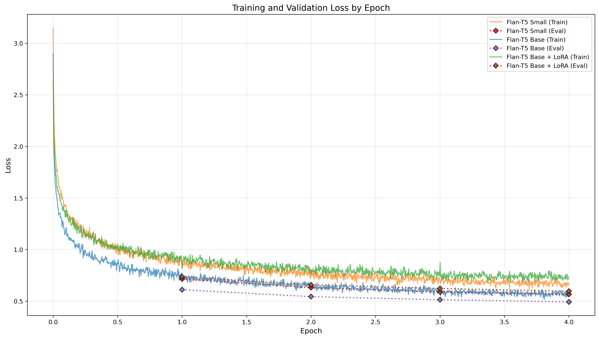
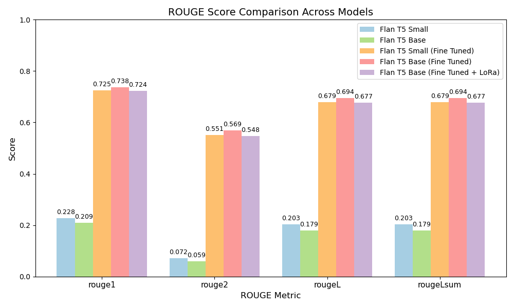

# Layperson Translation of Radiology Reports using FLAN-T5

Jesse Wang (48076306)

## Introduction

This project fine-tunes pretrained FLAN-T5 models to translate expert radiology reports into layperson-friendly summaries.

**Problem solved**: Automates the generation of patient-friendly medical summaries from technical radiology reports, improving accessibility and understanding for non-expert readers.

We evaluate fine-tuning the following model configurations:

- **FLAN-T5 Small**
- **FLAN-T5 Base** (with and without LoRA)

After tuning, the goal is to identify the best model that optimizes both:

- **Summary quality** (ROUGE scores and clarity)
- **Training efficiency** (compute and memory requirements)

### How It Works

1. **Dataset Preparation**: BioLaySumm2025 is split into train/validation/test sets and pre-processed (tokenization, prompt prepending, truncation/padding, label masking) via `dataset.py`.

2. **Model Training**: Baseline models (FLAN-T5 Small and Base) are trained using the training routines defined in `train.py`.

3. **Evaluation & Visualization**: Trained models generate predictions, which are evaluated using ROUGE-1, ROUGE-2, ROUGE-L, and ROUGE-Lsum metrics. Inference and generation of ROUGE comparison graphs are handled by `predict.py`.

## Dataset

**Source:** [BioLaySumm/BioLaySumm2025-LaymanRRG-opensource-track](https://huggingface.co/datasets/BioLaySumm/BioLaySumm2025-LaymanRRG-opensource-track)

The BioLaySumm2025 dataset contains expert radiology reports along with layperson-friendly summaries.

Each record includes:

- `radiology_report`: expert-written text

- `layman_report`: simplified summary

- `source`, `images_path`: unused metadata

> The `source` field was removed to avoid avoid potential data leakage or dataset-specific bias.
> However, reports from all three dataset sources (`PadChest`, `OpenI`, and `BIMCV-COVID19`) were still used, so the model learns from a range of radiology report styles without being exposed to their dataset origins.

### Dataset Splits

The **original** Hugging Face dataset contains 170,991 total samples:

- Train split: 150,454 samples
- Validation split: 10,000 samples
- Test split: 10,537 samples (removed due to missing `layman_report` column)

### Final Dataset:

An **80/20 split** was applied to the _original training set_ to create an internal **train/holdout** split.

> A 20% holdout was chosen to ensure a sufficiently large validation sample while retaining most data for training.

The **original Hugging Face validation split** was used directly as the final validation set.

Final splits:

- **Training split:** 120,363 samples
- **Validation split:** 10,000 samples
- **Test split:** 30,091 samples

## Pre-processing

Each step is found in `dataset.py` and ensures consistent, model-ready tensors:

1. **Instruction prompt**:
   Each radiology_report is prefixed with:

```
Provide a layman’s interpretation of this medical report:
```

to guide the model toward generating simplified summaries.

2. **Tokenization**:
   Both input (radiology_report) and target (layman_report) texts are tokenized using the FLAN-T5 tokenizer.

3. **Truncation & Padding**:
   Inputs are truncated or padded to a fixed length (max_input_length=512, max_output_length=128) for batch consistency.

4. **Label masking**:
   Padding tokens in the target sequences are replaced with -100, ensuring they’re ignored during loss computation.

5. **Column reduction**:
   After processing, only input_ids, attention_mask, and labels remain—removing raw text and metadata to streamline training and evaluation.

# Models

Two pretrained (un-tuned) models were used to establish baseline performance:

- **FLAN-T5 Small**
- **FLAN-T5 Base**

The following models were trained on the BioLaySumm dataset:

- **FLAN-T5 Small** – fully trained to assess smaller model performance
- **FLAN-T5 Base** – fully trained for improved summary quality
- **FLAN-T5 Base + LoRA** – parameter-efficient training using Low-Rank Adaptation (LoRA)

This approach allows us to systematically compare the three models and identify the configuration that offers the best balance of performance and training efficiency.

## Tuning

| Attribute                | **FLAN-T5 Small (Tuned)**   | **FLAN-T5 Base (Tuned)**    | **FLAN-T5 Base (LoRA)**        |
| ------------------------ | --------------------------- | --------------------------- | ------------------------------ |
| **Total Parameters**     | 76,961,152                  | 247,577,856                 | 247,577,856                    |
| **Trainable Parameters** | 76,961,152                  | 247,577,856                 | 3,538,944                      |
| **Trainable Fraction**   | 100%                        | 100%                        | 1.41%                          |
| **Learning Rate**        | 5e-5                        | 2e-5                        | 3e-3                           |
| **Epochs**               | 4                           | 4                           | 4                              |
| **Training Time**        | 1.7 hrs (~22 minutes/epoch) | 3.4 hrs (~45 minutes/epoch) | 1.85 hrs (~24.5 minutes/epoch) |
| **Batch Size**           | 8                           | 8                           | 16                             |

4 epochs was used for all models, as research indicates that fine-tuning LLMs for too many epochs can increase hallucinations. Additionally, this number provides a consistent basis for comparison across models.

> **Summary:**
>
> - The **FLAN-T5 Small (Tuned)** model served as a lightweight reference point to evaluate scalability improvements from larger models.
> - The **FLAN-T5 Base (Tuned)** model achieved higher-quality summaries but required more computational resources.
> - The **FLAN-T5 Base (LoRA)** configuration delivered a strong trade-off between performance, speed, and efficiency — fine-tuning only **1.41%** of parameters while maintaining comparable ROUGE scores.

# Results

## Training Loss Comparison



For 4 epochs of training, all three models reached convergence. Evaluation loss did not increase, indicating no overfitting.

Interestingly, the evaluation loss on the validation set was slightly lower than the training loss, likely due to dropout and optimizer noise being disabled during evaluation.

## Evaluation Metric - ROUGE

Evaluation was performed using the ROUGE metric family.

- **ROUGE-1**: Unigram overlap (measures content coverage).
- **ROUGE-2**: Bigram overlap (evaluates fluency and phrase accuracy).
- **ROUGE-L**: Longest common subsequence (captures coherence and structure).
- **ROUGE-Lsum**: Sentence-level ROUGE-L (reflects readability and sentence alignment).



From this graph, base is the best however, it takes too long to train. LoRA and small are around the same (LoRA slightly higher)

Inference Time:
Small (Fine Tuned): 12:38 minutes
Base + LoRA (Fine Tuned): 17:14 minutes
Base (Fine Tuned): 23:19 minutes

## Model Selection

After evaluating both training efficiency and summary quality:

- **FLAN-T5 Base (LoRA)** was selected as the best model:
  - Maintains ROUGE scores comparable to the fully fine-tuned Base model.
  - Fine-tunes only 1.41% of parameters → faster training, lower memory usage.
  - Provides a strong balance between performance and resource requirements.

> **Note:** Although the Small model achieves similar ROUGE scores and slightly faster inference, closer inspection shows it often retains technical jargon, making summaries less accessible to laypersons.
> In contrast, Base+LoRA preserves most of the Base model’s translation capability while remaining parameter-efficient and fast, making it the preferred choice for patient-friendly summaries.

This model is used for all example summaries and downstream analysis.

## Example Inference

> Using FLAN-T5 Base (LoRA). More can be found in this [results file](results/base_lora_results.json)

**Example 1**: Short report, Short summary, Heavy jargon

```json
Original Report: "Radiological improvement with resolution of left lower lobe infiltrate suggestive of pneumonia."

Reference Summary: "The X-ray shows that the lung issue in the lower left part has gotten better, suggesting that the pneumonia in that area has improved."

Predicted Summary: "The x-ray shows improvement, with the area of lung inflammation in the lower left part of the lung now cleared up."
```

**Example 2**: Short report, Short summary, Low jargon

```json
Original Report: "No relevant abnormalities."

Reference Summary: "There are no significant issues or abnormalities found."

Predicted Summary: "There are no significant issues found."
```

**Example 3**: Short report, Long summary, Heavy jargon

```json
Original Report: "Bilateral consolidations affecting both lower lobes, left more than right. Mild cardiomegaly. Minimal pleural effusion in the posterior costophrenic angle."

Reference Summary: "Both lower parts of the lungs have areas of solid tissue, with the left side being more affected than the right. The heart is slightly larger than normal. There is a small amount of fluid near the back of the lungs, where the chest wall meets the diaphragm."

Predicted Summary: "Both lower parts of the lungs have areas of solidified lung tissue, more on the left side than the right. The heart is slightly larger than normal. There is a small amount of fluid around the lungs at the back of the chest."
```

**Example 4**: Long Report, Long Summary, Heavy jargon

```json
Original Report: "Reason for consultation: ovarian carcinoma with subocclusive symptoms and peritoneal progression. Follow-up. Posteroanterior chest radiograph: no significant findings. Simple abdominal radiograph: nonspecific luminal pattern. No current signs of obstruction."

Reference Summary: "The patient came in because of ovarian cancer with symptoms that suggest the disease might be blocking something inside the body and spreading in the abdominal lining. This is a follow-up appointment. The chest x-ray shows nothing important. The abdominal x-ray shows a pattern that doesn't give a clear diagnosis. There are no signs right now that something is blocked."

Predicted Summary: "The patient came in because they have ovarian cancer that causes symptoms that are not related to the skin and the growth of the uterus. This is a follow-up check. The chest x-ray taken from the front shows no major issues. The simple abdominal x-ray shows a nonspecific pattern that could indicate fluid or other issues. There are no current signs of obstruction."
```

## Result Analysis

The FLAN-T5 Base (LoRA) model accurately captures the key content of reports across a range of lengths and complexity. Produced summaries are of appropriate length, and do not introduce irrelevant or hallucinated information.

Predictions don't match references exactly, but after reading both, it is clear they convey the same information naturally.
The main difference is the order of explanation rather than the content itself.

From the metrics point of view, all tuned models had the same trend:

- **ROUGE-1: Highest**

- **ROUGE-2: Lowest**

The gap between ROUGE-1 and ROUGE-2 is actually good. High unigram overlap (ROUGE-1) confirms accurate content capture, while lower bigram overlap (ROUGE-2) shows natural paraphrasing rather than memorization.

- **ROUGE-L ≈ ROUGE-Lsum**

Even though most summaries contain multiple sentences, both the sentence-level (ROUGE-L) and summary-level (ROUGE-Lsum) metrics are similar. This suggests the models maintain consistent structure both within and across sentences.

Overall, this aligns with our observations of the predicted summaries - the models learnt to summarise rather than copying training data. We would not want all metrics equally high as that would suggest memorization instead of genuine understanding.

- However, some limitations remain. Specific clinical terms (e.g., “pneumonia” in Example 1) or precise anatomical locations (e.g., “posterior costophrenic angle” in Example 3) can be lost or generalized. This indicates there is still room for improvement, preventing certain ROUGE scores from reaching 0.8.

## Hardware & Environment

Training and inference done on the Rangpur cluster:

| Component   | Version / Specification       |
| ----------- | ----------------------------- |
| **GPU**     | NVIDIA A100 PCIe (40 GB VRAM) |
| **Python**  | 3.9                           |
| **CUDA**    | 11.8                          |
| **PyTorch** | 2.5.1                         |

### Peak GPU Memory Usage

- **FLAN T5 Small**: 4.11 GB
- **FLAN T5 Base**: 11.20 GB
- **FLAN-T5 Base (LoRA)**: 15.61 GB

> The Base + LoRA model requires more GPU memory because it has LoRA parameters. Even though fewer parameters are trained, the full base model still needs to be loaded (due to the manual training loop), which increases overall memory usage compared to the standard Base model.

### Environment Setup

1. Create the conda environment from the YAML file:
   - This YAML file contains all the python packages required

```bash
conda env create -f requirements.yml
```

2. Activate the new environment:

```bash
conda activate bio_flan_t5
```

3. Verify installation (optional):

```bash
python -c "import torch; print(torch.__version__)"
```

### Reproducibility

- **Random seed**: Fixed at 0 for consistent data splits and training outcomes.
- **Configurations**: All hyperparameters and model settings stored in the `configs/` directory.
- **Environment**: Conda environment (`requirements.yml`) ensures identical package versions across runs.
- **Hardware**: Experiments conducted on a single NVIDIA A100 (40 GB VRAM) GPU to maintain consistency.

### Usage

#### Training

All model and training settings are defined in YAML config files located in the `/configs` directory.

**Available configs**:

- `t5_small.yaml` - Small T5 model (full fine-tuning)
- `t5_base.yaml` - Base T5 model (full fine-tuning)
- `t5_base_peft.yaml` - Base T5 model with LoRA (parameter-efficient)

To train a model:

1. Choose or create a config file in `/configs` (e.g., `t5_base_peft.yaml`)
2. Run the training script with the chosen config:

```bash
python train.py --config configs/t5_base_peft.yml
```

#### Inference

To evaluate and compare models (ROUGE score, summaries, comparison bar graph), edit the `model` list in `predict.py`:

```python
# In predict.py main() function:
pre_trained_small = PretrainedT5(model_name="google/flan-t5-small").to(device)
pre_trained_base = PretrainedT5(model_name="google/flan-t5-base").to(device)
tuned_small = FineTunedT5(model_path="./t5flan-small-results/best_model/pytorch_model.bin").to(device)
models = [pre_trained_small, pre_trained_base, tuned_small]
```

Then run:

```bash
python predict.py
```

# References

1. Chung, H. W., et al. (2022). Scaling Instruction-Finetuned Language Models. arXiv preprint arXiv:2210.11416. https://arxiv.org/abs/2210.11416

2. Paul Mooney (2023). Fine-tune FLAN-T5 with PEFT/LoRA (deeplearning.ai). https://www.kaggle.com/code/paultimothymooney/fine-tune-flan-t5-with-peft-lora-deeplearning-ai#2---Perform-Full-Fine-Tuning

3. Zoumana Keita (2023) FLAN-T5 Tutorial: Guide and Fine-Tuning. https://www.datacamp.com/tutorial/flan-t5-tutorial

4. Minki Jung (2024). Encoder-Decoder vs. Decoder-Only. https://medium.com/@qmsoqm2/auto-regressive-vs-sequence-to-sequence-d7362eda001e

5. Hugging Face. https://huggingface.co/spaces/evaluate-metric/rouge
